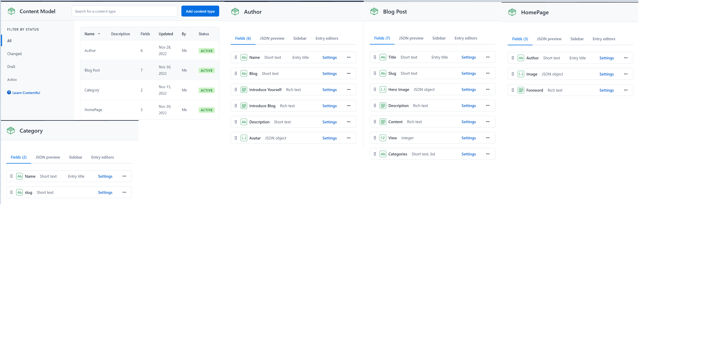
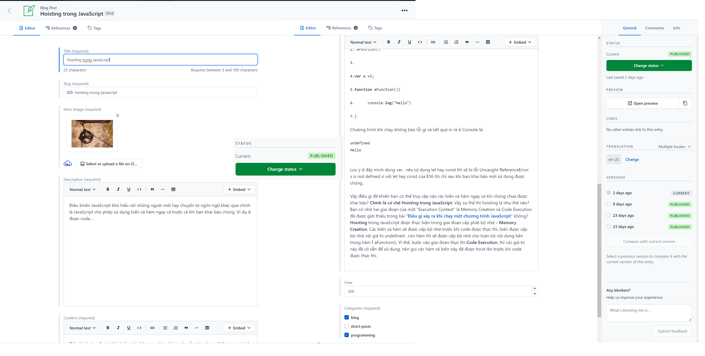
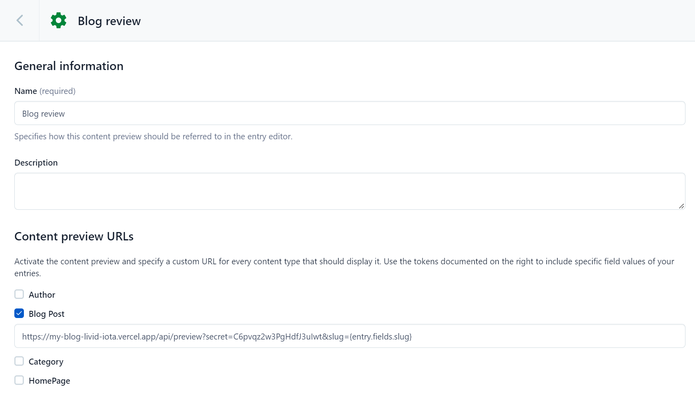
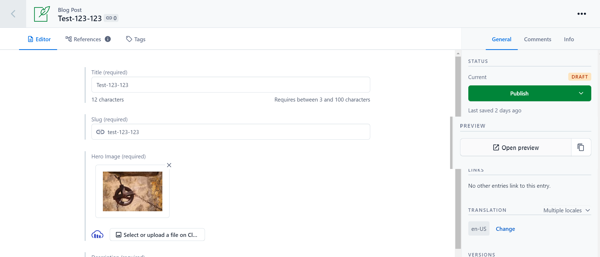

# NextJs Practice 1 Plan - My Blog

## **Overview**

**Below is detailed estimated plan for NextJS practice 1**

**Build my blog post page**

## **Requirements**

- **User can view post list.**
- **User can see post detail page**
- **User can search for posts**
- **User can filter posts by categories**

## **Target**

- **Apply core knowledges of NextJS (latest version):**
  - **Pre-rendering Strategies: SSG, ISR**
  - **next/image, next/link, next/router, @next/font…**
- **Get familiar with the concept of CMS.**
- **Apply features of nextjs: Api Routing.**
- **Unit Testing**
- **Storybook**

## **Tech Stacks**

- **React ES6**
- **TypeScript**
- **HTML5 / CSS3**
- **Material UI**
- **[Vercel](https://vercel.com/)**
- **[Contentful](https://www.contentful.com/)**
- **Developer tools:**
  - **pnpm**
  - **Eslint**
  - **Prettier**
  - **Husky**
  - **lint staged**
- **Storybook**
- **Jest**
- **react-testing-library (coverage >= 80%)**

## Developer

- **Thong Le**

## \***\*Suggestion Design\*\***

[BEAUTYONCODE](https://beautyoncode.com/)

## **Estimation Document**

[**Estimate Document Practice 1**](https://www.notion.so/Estimate-Document-Practice-1-1b9d684148fe4f67950dab23517db62b)

## **Component Document**

[Component **my blog post page**](https://www.notion.so/Component-my-blog-post-page-9ef3e8397a4e4b47af2d03a672ad3c5b)

## **Prerequisites**

- node: v16.14.0
- pnpm: 7.14.0

## **How to install and run app**

| Command                                                     | Action                                                                 |
| :---------------------------------------------------------- | :--------------------------------------------------------------------- |
| `pnpm install`                                              | Installs dependencies                                                  |
| `pnpm dev`                                                  | Run dev production at `http://localhost:3000`                          |
| `pnpm build`                                                | Run build for production before start production                       |
| `pnpm start`                                                | Run start on production at `http://localhost:3000`                     |
| `pnpm storybook`                                            | Start storybook dev at `http://localhost:6006/`                        |
| `pnpm build-storybook`                                      | build storybook                                                        |
| `pnpm lint`                                                 | run lint-staged check code before commit                               |
| `pnpm prepare`                                              | Install folder .husky                                                  |
| `pnpm test`                                                 | Testing application                                                    |
| `pnpm test:coverage`                                        | Testing application and get coverage                                   |
| deployment                                                  | [my-blog](https://my-blog-bay-seven.vercel.app/)                       |
| site-map                                                    | [http://localhost:3000/sitemap.xml](http://localhost:3000/sitemap.xml) |

## **Configuration**

## Configuration

### Step 1. Create an account and a space on Contentful

First, [create an account on Contentful](https://www.contentful.com/sign-up/).

After creating an account, create a new empty **space** from the [dashboard](https://app.contentful.com/) and assign to it any name of your liking.

### Step 2. Create a content model

#### Create the content model manually

##### Create an `Author` content type

From your contentful space, go to **Content model** and add a new content type:

- `Name` - **Text** field (type **short text**)
- `Blog` - **Text** field (type **short text**)
- `Introduce Yourself` - **Rich text** field
- `Introduce Blog` - **Rich text** field
- `Description` - **Text** field (type **short text**)
- `Avatar` - **Json object** field (type **cloudinary**)

Save the content type and continue.

##### Create an `Blog Post` content type

From your contentful space, go to **Content model** and add a new content type:

- `Title` - **Text** field (type **short text**)
- `Slug` - **Text** field (type **short text**)
- `Hero Image` - **Json object** field (type **cloudinary**)
- `Description` - **Rich text** field
- `Content` - **Rich text** field
- `View` - **Integer** field
- `Categories` - **Text** field (type **short text**, **list**)

Save the content type and continue.

##### Create an `Category` content type

From your contentful space, go to **Content model** and add a new content type:

- `Name` - **Text** field (type **short text**)
- `Slug` - **Text** field (type **short text**)

Save the content type and continue.

##### Create an `HomePage` content type

From your contentful space, go to **Content model** and add a new content type:

- `Name` - **Text** field (type **short text**)
- `Image` - **Json object** field (type **cloudinary**)
- `Foreword` - **Rich text** field

Save the content type and continue.

### Step 3. Validate your content model

After setting up the content model (either manually or by running `npm run setup` or `yarn setup`), it should look as follows.

**Content model overview**



### Step 4. Populate Content

Go to the **Content** section in your space, then click on **Add entry** and select the **Author** content type:

- You just need **1 author entry**.
- Use dummy data for the text.
- For the image, you can download one from [Unsplash](https://unsplash.com/).

Next, create another entry with the content type **Post**:

- We recommend creating at least **2 post entries**.
- Use dummy data for the text.
- For images, you can download them from [Unsplash](https://unsplash.com/).
- Pick the **author** you created earlier.

**Important:** For each entry and asset, you need to click on **Publish**. If not, the entry will be in draft state.



### Step 5. Set up environment variables

From your contentful space, go to **Settings > API keys**. There will be an example Content delivery / preview token - you can use these API keys. (You may also create a new key.)

Next, copy the `.env.local.example` file in this directory to `.env.local` (which will be ignored by Git):

```bash
cp .env.local.example .env.local
```

Then set each variable on `.env.local`:

- `NEXT_PUBLIC_CONTENTFUL_BASE_API_URL=https://cdn.contentful.com`
- `NEXT_PUBLIC_CONTENTFUL_SPACE_ID` should be the **Space ID** field of your API Key
- `NEXT_PUBLIC_CONTENTFUL_ACCESS_TOKEN` should be the **[Content Delivery API](https://www.contentful.com/developers/docs/references/content-delivery-api/) - access token** field of your API key
- `NEXT_PUBLIC_CONTENTFUL_PREVIEW_TOKEN` should be the **[Content Preview API](https://www.contentful.com/developers/docs/references/content-preview-api/) - access token** field of your API key
- `NEXT_PUBLIC_CONTENTFUL_SECRET_KEY` should be any value you want. It must be URL friendly as the dashboard will send it as a query parameter to enable preview mode
- `NEXT_PUBLIC_TRACKING_ID` should be the **[Analytics](https://analytics.google.com/)**

#### Your `.env.local` file should look like this:

```bash
NEXT_PUBLIC_CONTENTFUL_BASE_API_URL=https://cdn.contentful.com
NEXT_PUBLIC_CONTENTFUL_SPACE_ID=
NEXT_PUBLIC_CONTENTFUL_ACCESS_TOKEN=
NEXT_PUBLIC_CONTENTFUL_PREVIEW_TOKEN=
NEXT_PUBLIC_CONTENTFUL_SECRET_KEY=
NEXT_PUBLIC_TRACKING_ID=

```

### Step 6. Run Next.js in development mode

```bash
pnpm install
pnpm run dev
# or
yarn install
yarn dev
```

Your blog should be up and running on [http://localhost:3000](http://localhost:3000)! If it doesn't work, post on [GitHub discussions](https://github.com/vercel/next.js/discussions).

### Step 7. Try preview mode

In your Contentful space, go to **Settings > Content preview** and add a new content preview for development.

The **Name** field may be anything, like `Development`. Then, under **Content preview URLs**, check **Post** and set its value to:

```
https://<your-site>/api/preview?secret=<NEXT_PUBLIC_CONTENTFUL_SECRET_KEY>&slug={entry.fields.slug}
```

Replace `<NEXT_PUBLIC_CONTENTFUL_SECRET_KEY>` with its respective value in `.env.local`.



Once saved, go to one of the posts you've created and:

- **Update the title**. For example, you can add `[Draft]` in front of the title.
- The state of the post will switch to **CHANGED** automatically. **Do not** publish it. By doing this, the post will be in draft state.
- In the sidebar, you will see the **Open preview** button. Click on it!



You will now be able to see the updated title. To exit preview mode, you can click on **Click here to exit preview mode** at the top of the page.

### Step 8. Deploy on Vercel

You can deploy this app to the cloud with [Vercel](https://vercel.com?utm_source=github&utm_medium=readme&utm_campaign=next-example) ([Documentation](https://nextjs.org/docs/deployment)).

#### Deploy Your Local Project

To deploy your local project to Vercel, push it to GitHub/GitLab/Bitbucket and [import to Vercel](https://vercel.com/new?utm_source=github&utm_medium=readme&utm_campaign=next-example).

**Important**: When you import your project on Vercel, make sure to click on **Environment Variables** and set them to match your `.env.local` file.

#### Deploy from Our Template

Alternatively, you can deploy using our template by clicking on the Deploy button below.

This will deploy the Next.js project as well as connect it to your Contentful space using the Vercel Contentful Integration. If you are using Preview Mode, make sure to add `CONTENTFUL_PREVIEW_SECRET` as an [Environment Variable](https://vercel.com/docs/environment-variables) as well.
